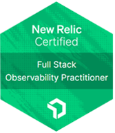

## Hi there 👋

I am an Operational Intelligence/DWBI Engineer from Ukraine💙💛

- 🔭 I’m working as an OI Engineer and responsible for analyzing operational data to identify efficiency opportunities.
- ⚡ In my spare time, I explore the world of Data Engineering.
- 📫 Get in touch with me: 

### ⚒️ Languages and Tools

  &nbsp;
  &nbsp;
  &nbsp;
  &nbsp;
  &nbsp;
  &nbsp;
  &nbsp;
  &nbsp;
  &nbsp;
  &nbsp;
  &nbsp;
  &nbsp;
  &nbsp;
  &nbsp;
  &nbsp;
  &nbsp;
  &nbsp;
  &nbsp;
  &nbsp;
  &nbsp;
 

 
### ✨ Certifications

  
  
  
  
  
  
  

